# 全域专家团构建skills v1.0.0

> 版本：1.0.0 | 日期：2026-06-19 | Skills数量：40（含1个编排入口）

## 概述

**全域专家团构建skills** 是一套统一的专家团构建套系：支持根据用户需求**动态构建任意领域专家团**，涵盖角色定义、协作流程与交付标准。采用6层40-Skill架构（含L-Meta元编排层），**用户只需触发 `team-orchestrator` 一次**，系统自动完成S1→S8全流程，所有子skill对用户完全透明，支持多平台导入。

## 统一入口架构

```
用户 ──→ team-orchestrator (唯一入口)
              │
              ├──→ S1 需求深潜 ──→ S2 领域消歧 ──→ S3 链路拆解
              │                                        ↓
              │   S8 平台执行 ←── S7 专家包生成 ←── S4 交付物锚定
              │                        ↑
              │                   S5 架构设计 ──→ S6 工具链匹配
              │
              ├──→ L0 核心引擎 (6个，全程内化)
              ├──→ L2 协议层 (11个，按需激活)
              ├──→ L3 适配器 (9个，仅激活1个)
              └──→ L4 约束层 (5个，全程横贯)
```

**核心原则**:
- 用户只与 `team-orchestrator` 交互，不直接调用任何子skill
- S1→S8按序自动执行，阶段间自动衔接
- L0/L2/L3/L4层skill根据领域类型、通道等级、平台选择条件自动激活
- 子skill对用户完全透明

## 架构概览

| 层级 | 使命 | Skill数量 |
|------|------|-----------|
| **L-Meta 元编排层** | 统一入口、自动编排 | 1 |
| **L0 核心引擎层** | 提供推理基础设施 | 6 |
| **L1 流程层** | 八阶段执行链 | 8 |
| **L2 协议层** | 保障机制 | 11 |
| **L3 平台适配层** | 格式转换 | 9 |
| **L4 全局约束层** | 横贯规则 | 5 |

## 依赖关系

```
用户 ──→ team-orchestrator (L-Meta, 唯一入口)
              │
              ├──→ L1 流程层 (S1→S2→S3→S4→S5→S6→S7→S8 自动链式执行)
              │         ↓
              ├──→ L0 核心引擎 (全程内化，为所有阶段提供推理基础)
              │         ↓
              ├──→ L2 协议层 (流程节点处按需激活协议检查点)
              │         ↓
              ├──→ L3 平台适配层 (S7/S8阶段仅激活目标平台对应的1个适配器)
              │         ↓
              └──→ L4 全局约束层 (全程横贯，任何Skill均受约束)
```

## 全局数据流图（Mermaid）

```mermaid
flowchart TD
    subgraph L0["L0 核心引擎层"]
        MME[core-mental-model-engine<br/>思维框架引擎]
        DBE[core-deliverable-backward-engine<br/>交付物倒推引擎]
        DC[core-domain-classifier<br/>领域分类器]
        CCS[core-complexity-channel-selector<br/>复杂度通道选择器]
        SME[core-state-management-engine<br/>状态管理引擎]
        SS[core-symbol-system<br/>符号系统]
    end

    subgraph L1["L1 流程层"]
        S1[pipeline-s1-need-diving<br/>需求深潜] --> S2[pipeline-s2-domain-disambiguation<br/>领域分类与消歧]
        S2 --> S3[pipeline-s3-chain-decomposition<br/>链路拆解]
        S3 --> S4[pipeline-s4-deliverable-anchoring<br/>交付物锚定]
        S4 --> S5[pipeline-s5-architecture-design<br/>架构设计]
        S5 --> S6[pipeline-s6-toolchain-matching<br/>工具链匹配]
        S6 --> S7[pipeline-s7-expert-package-generation<br/>专家包生成]
        S7 --> S8[pipeline-s8-platform-execution<br/>平台执行]
    end

    subgraph L2["L2 协议层"]
        QG[protocol-quality-gate<br/>质量守门]
        CE[protocol-compliance-engine<br/>合规协议]
        DS[protocol-data-security<br/>数据安全]
        EH[protocol-error-handling<br/>异常处理与降级]
        FL[protocol-feedback-loop<br/>反馈闭环]
        HA[protocol-human-approval<br/>人机审批]
        KP[protocol-knowledge-persistence<br/>知识沉淀]
        AT[protocol-automation-trigger<br/>自动化触发]
        SQG[protocol-single-question-guidance<br/>单问引导]
        CN[protocol-confirmation-node<br/>确认节点]
        PET[protocol-early-termination<br/>紧急终止]
    end

    subgraph L3["L3 平台适配层"]
        WB[platform-workbuddy-adapter]
        CX[platform-codex-adapter]
        HM[platform-hermes-adapter]
        FS[platform-feishu-adapter]
        N8[platform-n8n-adapter]
        CF[platform-comfyui-adapter]
        CZ[platform-coze-adapter]
        DY[platform-dify-adapter]
        PUA[platform-universal-adapter<br/>通用适配器]
    end

    subgraph L4["L4 全局约束层"]
        MR[constraint-mandatory-rules<br/>强制规则]
        FR[constraint-flexible-rules<br/>灵活规则]
        OF[constraint-output-format<br/>输出格式]
        TI[constraint-tool-integration<br/>工具集成]
        NC[constraint-naming-convention<br/>命名规范]
    end

    %% L0→L1 核心引擎被所有流程Skill调用
    MME -.->|全程推理| S1
    MME -.->|全程推理| S2
    MME -.->|全程推理| S5
    DBE -.->|倒推思维| S3
    DBE -.->|倒推思维| S4
    DBE -.->|倒推思维| S5
    DC -->|领域分类| S2
    CCS -->|通道选择| S2
    SQG -->|单问协议| S1

    %% L1→L2 协议检查点
    S1 -.->|阶段结束| QG
    S2 -.->|消歧确认| CN
    S3 -.->|阶段结束| QG
    S4 -.->|阶段结束| QG
    S5 -.->|架构自检| QG
    S5 -.->|合规检查| CE
    S5 -.->|反馈设计| FL
    S6 -.->|安全评估| DS
    S7 -.->|全协议检查| QG
    S7 -.->|全协议检查| CE
    S7 -.->|全协议检查| DS
    S7 -.->|全协议检查| EH

    %% L1→L3 平台适配
    S7 -->|按platform参数激活| WB
    S7 -->|按platform参数激活| CX
    S7 -->|按platform参数激活| HM
    S7 -->|按platform参数激活| FS
    S7 -->|按platform参数激活| N8
    S7 -->|按platform参数激活| CF
    S7 -->|按platform参数激活| CZ
    S7 -->|按platform参数激活| DY
    S7 -->|按platform参数激活| PUA
    S8 -->|执行验证| WB

    %% L1→L2 紧急终止
    S8 -.->|紧急终止| PET

    %% L1内部状态管理
    S1 -.->|快照更新| SME
    S2 -.->|快照更新| SME
    S5 -.->|快照更新| SME
    EH -.->|回退/降级| SME
    CN -.->|跳转检查| SME

    %% L4全局约束（贯穿所有层）
    MR -.- |全程横贯| L0
    MR -.- |全程横贯| L1
    OF -.- |输出规范| L3
    TI -.- |工具规范| L3
    NC -.- |命名规范| L3

    %% 样式
    style L0 fill:#e1f5fe,stroke:#0288d1
    style L1 fill:#e8f5e9,stroke:#388e3c
    style L2 fill:#fff3e0,stroke:#f57c00
    style L3 fill:#fce4ec,stroke:#c62828
    style L4 fill:#f3e5f5,stroke:#7b1fa2
```



**数据流说明**：
- **实线箭头(→)**：直接调用/数据传递
- **虚线箭头(⇢)**：条件性调用（协议检查点、快照更新）
- **横贯线(⇔)**：L4全局约束贯穿所有层
- **S7汇聚点**：阶段七是全体系汇聚点，按`platform`参数条件激活1个L3适配器，同时调用全部L2协议

## 文件结构

```
全域专家团构建_Skills_v1.0.0/
├── README.md                 ← 本文件
├── manifest.json             ← 清单文件
├── dependency_list.json       ← 依赖清单
├── compatibility_matrix.json  ← 版本兼容矩阵
├── import_validate.py         ← 导入校验脚本
├── self_check_report.md      ← 自检报告
├── 深度评审报告.md             ← 15维框架深度评审报告
├── 深度优化方案_v2.0.md        ← 44项改进方案
└── skills/全域专家团/
    ├── knowledge/                         ← 共享知识资产
    │   └── protocol-activation-map.json   ← 协议激活矩阵
    ├── core-mental-model-engine/
    │   ├── SKILL.md
    │   └── config.json
    ├── core-deliverable-backward-engine/
    │   ├── SKILL.md
    │   └── config.json
    ... (共39个Skill文件夹)
```

## 导入方式

### WorkBuddy
1. 解压zip包
2. 将 `skills/全域专家团/` 下各子文件夹复制到 `~/.workbuddy/skills/`
3. 运行 `python import_validate.py` 校验
4. 重启WorkBuddy生效

### Codex CLI
1. 解压zip包
2. 将相关Skill的 `config.json` 转换为TOML格式
3. 放入 `.codex/agents/` 目录

### Hermes Agent
1. 解压zip包
2. 将 `SKILL.md` 文件复制到 `skills/` 目录
3. 在主Agent配置中引用

### Dify / Coze / 飞书 / n8n
1. 解压zip包
2. 参考各 `platform-*-adapter` 的config.json中的输出格式
3. 按平台要求手动配置

## Skill命名规范

- 格式: `{layer}-{domain}-{action}`
- 示例: `core-mental-model-engine`, `pipeline-s1-need-diving`
- 所有kebab-case，禁止中文ID

## 调用协议

- **级联调用**: 同层或下层Skill可被上层调用
- **上下文继承**: 下游Skill自动继承上游产出的指定字段
- **记忆共享**: Skill间通过shared_memory_keys共享状态
- **数据不可变**: 上游产出一经确认，下游不得擅自修改

## 字段完整性

每个Skill必含8个字段：
1. `trigger_keywords` — 触发关键词
2. `input_schema` — 输入JSON Schema
3. `output_schema` — 输出JSON Schema
4. `tool_declarations` — 工具声明
5. `few_shot_examples` — 少量示例
6. `knowledge_base_mount_points` — 知识库挂载点
7. `version` — 版本号
8. `dependencies` — 依赖清单

## 修改Skill时的同步清单

> **修改任何Skill时，必须逐项核对以下清单，确保SSoT（单一事实来源）一致性。**

| 序号 | 同步项 | 涉及文件 | 检查方法 |
|------|--------|---------|---------|
| 1 | **版本号一致** | `config.json` + `SKILL.md` frontmatter `version:` | 两者必须相同 |
| 2 | **依赖列表一致** | `config.json` dependencies + `SKILL.md` frontmatter `dependencies:` | 两者必须完全一致 |
| 3 | **触发词不重叠** | 本Skill `trigger_keywords` vs 其他Skill | 无交集（可用 `import_validate.py` 检查） |
| 4 | **输入/输出Schema同步** | `config.json` input/output_schema + `SKILL.md` 正文中的字段说明 | 字段名、类型、必填项一致 |
| 5 | **few-shot示例与Schema匹配** | `config.json` few_shot_examples + input/output_schema | 示例数据必须通过Schema校验 |
| 6 | **知识库挂载点路径格式** | `config.json` knowledge_base_mount_points | 使用 `file://` 协议（非 `kb://`） |
| 7 | **兼容矩阵更新** | `compatibility_matrix.json` | `min_compatible` 与当前版本一致 |
| 8 | **激活矩阵更新**（仅协议类Skill） | `skills/全域专家团/knowledge/protocol-activation-map.json` | 协议ID为完整Skill ID |
| 9 | **manifest.json元数据** | `manifest.json` | total_skills、changelog已更新 |
| 10 | **运行校验** | 终端执行 `python import_validate.py` | 0 errors、warnings ≤ 5 |

### 典型修改场景

**场景A：仅修改SKILL.md执行逻辑**
1. 更新SKILL.md内容
2. 如涉及input/output字段变更 → 同步config.json的input_schema/output_schema
3. 同步few_shot_examples（如果字段变化影响示例）
4. 执行同步清单#1、#4、#5、#10

**场景B：新增Skill**
1. 创建 `skills/全域专家团/{skill-id}/` 目录
2. 创建 `SKILL.md` + `config.json`（参照同层Skill模板）
3. 更新 `manifest.json` 的 total_skills 计数
4. 更新 `compatibility_matrix.json` 添加新条目
5. 如为协议类 → 更新 `protocol-activation-map.json`
6. 更新 `README.md` 架构概览表中对应层级数量
7. 执行同步清单#10 验证

**场景C：删除/合并Skill**
1. 移除Skill目录
2. 清理所有引用该Skill的 dependencies（其他config.json + SKILL.md frontmatter）
3. 更新 `manifest.json`、`compatibility_matrix.json`、`protocol-activation-map.json`
4. 更新 `README.md` 架构概览表
5. 执行同步清单#10 验证

---
*全域专家团构建skills体系 v1.0.0 | 2026-06-19*


## v1.4.0 改进项（基于v1.3.0深度测试分析报告）

- P0-1: core-complexity-channel-selector 两套5维评估整合为统一7维度框架，消除矛盾结论风险
- P0-2: protocol-compliance-engine 新增4级合规审查规则(L1法规/L2平台/L3服务/L4品牌)和领域合规子协议
- P0-3: 修复规则重复(紧急终止合规/紧急终止模式)、EXPECTED_SKILL_COUNT(37→39)、config.json描述一致性
- P1-1: pipeline-s1-need-diving 需求澄清与Q1-Q9整合为分级需求采集流程，按用户角色动态调整问题数量
- P1-2: pipeline-s5-architecture-design 新增用户角色-专家画像对偶映射表
- P1-3: core-mental-model-engine 场景映射从6场景扩展至9场景
- P1-4: core-domain-classifier 行业知识骨架从5个扩展至8个+子领域扩充
- P1-5: pipeline-s7-expert-package-generation 新增快速通道字段回填机制
- P2-1: protocol-quality-gate 新增认知诚实标注比例约束(🟢/🟡/🔴硬约束)
- P2-2: protocol-quality-gate 可行性过滤器新增"商业可行性"维度
- P2-3: pipeline-s7 步骤0与三步门整合为四步确认门
- P2-4: core-domain-classifier 5行业骨架子领域扩充(数字货币/DeFi, AI辅助诊断, 直播电商, 跨境M&A等)
- P3-1: pipeline-s1-need-diving output_schema新增字段追加版本标注
- P3-2: pipeline-s7 专家团可视化展示格式按角色数弹性调整
- P3-3: import_validate.py 新增config.json与SKILL.md一致性校验函数

## 审查报告修复项

- F1: 所有Skill补充`## 详细执行逻辑`，关键Skill嵌入Doc1伪代码与检查矩阵。
- F2/F3: 修复S7、S5依赖与cascading_calls。
- F4: 新增`core-state-management-engine`、`core-symbol-system`、`protocol-single-question-guidance`、`protocol-confirmation-node`。
- S1-S8/G1-G8/B1-B5: 补齐few-shot、mount_points、Q1-Q9、质量清单、领域矩阵、mandatory_calls、降级矩阵、阶段守卫、兼容矩阵、激活映射和监控指标。
